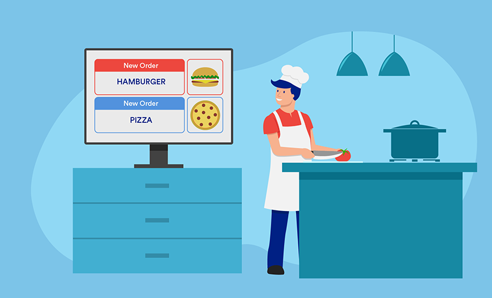

# SDLC-Team-24
* ## **_~~No longer standing in queues waiting hours for your turn at restaurantants in peak hours~~_** 👎 👎 
* ## **_NOW YOU DON'T HAVE TO BECAUSE TEAM-24 HAVE COME UP WITH A SOLUTION_**: 👇 ⏬ ⬇️ 🔽 👇 
# FOOD ORDERING MANAGEMENT SYSTEM

Badge Name | Status |
-----------|---------|
CI | [![CI]] |
Build | [![Linux C/C++ Build CI]] |
Git Inspector | [![Contribution Check - Git Inspector]]|
Unity Test | [![Unit Testing - Unity]] |
Static Analysis Cppcheck | [![Code Quality - Static Code - Cppcheck]] |
Codacy | [![Codacy Badge] |
Code Coverage | [![CI-Coverage]] |

# Introduction
<<<<<<< HEAD
=======

>>>>>>> 47fcf6d1acbb873eac680b494b7dff91c7d23fbe
* Food Order Management System is based on the concept of ordering food and managing employee records. The user can freely use its feature. This application has two categories; Admin section and customer section. Admin section, from where the user can manage employee and customer section, from where a user can order food. This mini project contains limited features, but the essential one. To run the project use code editor for C programming language. Once you have the code editor, then, download this project. Once the download is complete then extract it. After that, open the project file with the code editor. After that, first build the project and then finally run the project.

* About the system
Talking about the features of this Simple system, the user can simply order foods by selecting food items, entering a customer name, quantity. From the admin section, the user can manage food records by entering its, price, quantity available. The admin can also view the last orders of the customers, the orders made in card mode and whole day payment too.

<<<<<<< HEAD

=======
>>>>>>> 47fcf6d1acbb873eac680b494b7dff91c7d23fbe

## Folder Structure
Folder               | Description
---------------------|---------------------------------------------------
`1_Requirements`     | Files detailing requirements and research done
`2_Architecture`     | Documents detailing the architecture used
`3_Implementation`   | All code and relevant documentation
`4_TestPlanAndOutput`| Documents with test plan and output
`5_Report`           | Report on the implemented C Miniproject
`6_ImagesAndVideos`  | Files containing working video and images
`7_Other`            | Other supporting documents

<<<<<<< HEAD
## Contributors List and Summary
| SF_ID | Name | Features | Issues Raised | Issues Solved | No. of Test Cases | No. of Test Cases Passing |
|-----|-----|-----|-----|-----|-----|-----|
| 99004312 | Isha Satapathy | All | - | - | - | -
| 99004312 | Raghav Asawa | All | 2 | 1 | - | -
| 99004312 | Syed Basit Ahmad | All | 3 | 3 | 1 | 1
| 99004312 | Suraksha S S | All | - | - | - | -
| 99004312 | Praveen C | All | 1 | 1 | - | -
=======
Badge Name | Status |
-----------|---------|
CI | [![CI]] |
Build | [![Linux C/C++ Build CI]] |
Git Inspector | [![Contribution Check - Git Inspector]]|
Unity Test | [![Unit Testing - Unity]] |
Static Analysis Cppcheck | [![Code Quality - Static Code - Cppcheck]] |
Codacy | [![Codacy Badge] |
Code Coverage | [![CI-Coverage]] |

## Contributors List and Summary
| SF_ID | Name | Features | Issues Raised | Issues Solved | No. of Test Cases | No. of Test Cases Passing |
|-----|-----|-----|-----|-----|-----|-----|
| 99004310 | Isha Satapathy | All | 2 | 1 | 2 | 2
| 99004311 | Raghav Asawa | All | 2 | 2 | 2 | 2
| 99004312 | Syed Basit Ahmad | All | 3 | 3 | 1 | 1
| 99004313 | Suraksha S S | All | - | - | - | -
| 99004314 | Praveen C | All | 1 | 1 | - | -
>>>>>>> 47fcf6d1acbb873eac680b494b7dff91c7d23fbe

### Language ,Tools , Database used
* **Unit test** cases for almost each function.
* **Makefile** for **compilation**, **running test** cases and additional targets.
* **Documentation** using **Doxygen**.
* **cppcheck** and **Valgrind** tools to analyze the code.
* **File System** for Database and **C** language is used.

### Steps to install on your system locally
- [x] Clone the repository
- [x] make all
- [x] make run
- [x] make test (for testing) 

<<<<<<< HEAD

## Srum Meeting
=======
## Scrum Meeting
>>>>>>> 47fcf6d1acbb873eac680b494b7dff91c7d23fbe

## SPRINT-1 RETROSPECTIVE 

## SPRINT Burndown
-0.png)
